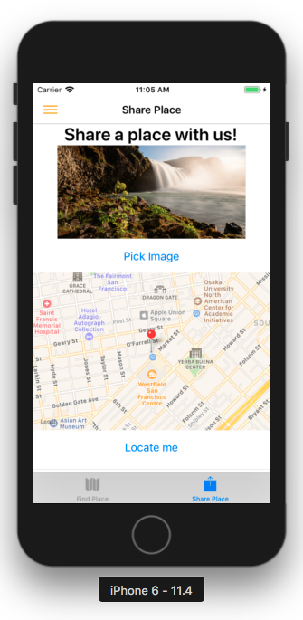

# Awesome Places

Awesome places is a react-native demo application to share places.

There you can sign-up (auto sign-in), or sign-in. Next, you are redirected to Find Places screen where you can view shared places and delete them.

To share a new place, all you need is to provide an image, taking one or picking one from your gallery, next click on "Locate me" to point to your current location or move into the map to select a place. 
Finally, add a name to the place and click on "Share Place".

After the place is shared you are redirected to Find Place again where you should see it.

Data and images are stored in a test database/storage on google firebase.

The project was created with "create-react-native-app", next we ejected, 
to gain access to android/ios folders to run on android and ios emulators/devices, 
install and link libraries that run native code.

# Test it!

Clone the project from: git@github.com:BuiltByBROS/react-native-demo.git

# Install dependencies

```sh
npm install
```

# Run on IOS Simulator

Download and install Xcode.


```sh
npm run ios
```

# Run on Android Simulator

Download and install Android Studio. Make sure to select: Android SDK, Android SDK platform (API 27)

Add the following env variables to your bash profile:

export ANDROID_HOME=/Users/{username}/Library/Android/sdk
export ANDROID_SDK_ROOT=/Users/{username}/Library/Android/sdk

To run on android emulator device: open Android Studio, 
select "Open an existing Android Studio Project" and locate react-native-demo/android folder.

Next go to tools -> AVD Manager, create or select a virtual device and run it.

Once emulator is running you can type:

```sh
npm run android
```

# Run on Android device:

Just plug in your phone and enable USB debugging.

# Run on IOS device:

Open Xcode, select the device, make sure to enter a developer team.

NOTE: To be able to run on devices, both computer and device must share the same network.


